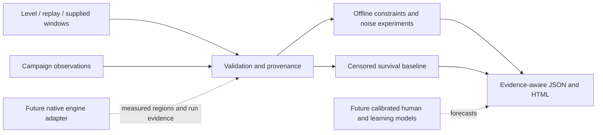

# AXIOM architecture

AXIOM separates evidence acquisition, execution models, learning models, and publication. The initial release is an offline Python laboratory; native Geometry Dash integration is a later milestone.

## Initial implementation surface

The offline tool accepts explicitly supplied local windows, simple joint constraints, replay events, level payloads, captured trial tables, and first-completion observations. It validates inputs, performs reproducible seeded window/noise experiments, summarizes censored campaigns with Kaplan-Meier, and exports JSON and a local HTML report. Level inspection and replay inspection are structural descriptions; they do not simulate collisions or prove a run succeeds.

Synthetic fixtures are labeled synthetic. Externally measured inputs remain externally measured and unverified unless an engine-evidence package is audited. A result generated from mathematical windows is conditional on those windows. Captured trial-table validation checks reported identity and full-run oracle fields; it does not independently reproduce the run or authenticate the collector. Successful finite timing samples are not proof of a continuously feasible interval between those samples. Reports must keep those limitations next to numerical results.

## Component boundaries

| Component | Responsibility | Must not claim |
|---|---|---|
| Ingestion | Preserve raw evidence, validate units/order, canonicalize metadata, hash payloads | That a file's reported engine version is independently verified |
| Level inspector | Decode known serialization fields and report objects/settings | Exact hitboxes, active trigger semantics, or physical reachability |
| Replay inspector | Normalize documented formats, presses/releases, players, and clocks | Compatibility with every macro format or successful native playback |
| Constraint analyzer | Membership in supplied local/joint feasible regions | Discovery of the complete feasible set in the game |
| Execution baseline | Seeded, declared correlated noise; conditional success and numerical uncertainty | Human calibration or perception-aware control |
| Survival baseline | Risk sets, censoring, descriptive median where supported | A causal learning model or unbiased predictions under informative dropout |
| Rating presentation | Apply a declared scale and expose reference identity | A calibrated real-level AR without supporting evidence |
| Evidence report | Keep identities, assumptions, source hashes, warnings, and reproducible settings attached | Validation by visual polish or a large numerical sample alone |

Evidence states are distinct: **synthetic**, **externally measured**, **native verified**, and **human calibrated** describe origins or validation, not successive values of a generic accuracy score. A physical witness and a calibrated human forecast answer different questions.

The v0.1 challenge record uses `id`, `level_sha256`, `game_version`, `physics_version`, `input_policy`, and `environment_id`. Native evidence will need the richer manifest below. For the offline Gaussian baseline, independent per-action error, a common run shift, and stationary AR(1) drift have separately declared scales; serial correlation is a sensitivity assumption. Route membership also checks same-channel press/release ordering. A Wilson interval summarizes numerical sampling error conditional on all these inputs.

## Identity and evidence package

Every experiment should retain a manifest containing:

- Schema, analyzer/model version and source commit; input artifact SHA-256 values.
- Challenge identity: raw level hash and serialization, game build/binary hash, adapter build, physics and input policy, environment and mod configuration.
- Origin and collection method, author/collector where consent permits, capture time, uncertainty and measurement resolution.
- Strategy/replay hash, observation protocol, boundary/initial-state identity, completion oracle, noise settings, sample count, random seed and generator version.
- Dataset/reference-population/model hashes, splits, provenance limitations, and evidence status.

The logical challenge identifier is a hash of a canonical, versioned identity manifest. Keep raw file hashes too: identical labels or parsed object counts are insufficient. Define canonicalization before cross-tool comparisons; the initial prototype may retain metadata without implementing the full native manifest.

## Native engine adapter contract (design, not implemented)

The adapter runs a legally installed Geometry Dash build through documented version-specific hooks. Geode is a candidate integration framework; its hook API is infrastructure, not proof that arbitrary captured state is complete. [Geode hooks](https://docs.geode-sdk.org/handbook/vol1/chap1_3/)

| Operation | Required behavior |
|---|---|
| `describe_environment()` | Return binary/build/adapter hashes, configuration, clocks, input acceptance rules, mod identities, capabilities, and unsupported features |
| `load_challenge(manifest)` | Verify the exact payload and settings; reject identity mismatch |
| `reset_to_start(seed)` | Start from the actual challenge beginning with declared random/clock state and released input policy |
| `apply_input(event)` | Schedule press/release for player/button on a declared simulation clock; acknowledge actual acceptance time |
| `step_until(target)` | Advance using declared update/event order and return collisions, deaths, state digests and observation timestamps |
| `capture_state()` / `restore_state()` | Export/restore every future-relevant state item or declare restoration unsupported; never assume a visible position is sufficient |
| `observe()` | Return only player-accessible render/audio/cue data for the human-model interface |
| `run(replay, horizon)` | Execute from an identified initial state and return a same-run evidence package, with stop reason |
| `completion_oracle()` | Detect the engine's final completion event under normal permitted play; death, truncation and unknown are separate outcomes |

Coordinate/state access is restricted to physical verification and measurement. Human controllers receive the observation stream and allowed learned information. Enforce that boundary in the API rather than relying on a convention.

## Native acceptance gates

1. **Identity:** exact same challenge, replay, binaries, configuration, clocks and permitted modifications are captured for each run.
2. **Determinism:** repeat from the true start; compare full trajectories or declared numerical tolerances, death/completion events, and input acceptance. Publish divergence rates and unresolved causes. Determinism is measured per configuration, not presumed universal.
3. **Checkpoint completeness:** restoring a captured state reproduces the continuation against a full-run control. Uncaptured triggers, object movement, held inputs, or clocks invalidate section composition.
4. **Reachable boundaries:** obtain entry states from an actual prefix; carry physical, controller-memory, learning/fatigue and timing state into the suffix. Do not reset noise or human state at section seams.
5. **Final oracle:** certify a complete run from the genuine beginning to the engine's completion event. Alive at a local horizon or 100% displayed progress is insufficient.
6. **Measurement:** probe early/late and joint perturbations with declared resolution and continuation; include negative controls, delayed failure tests and alternative routes.

All gates must refer to the same run/configuration lineage. A passing suffix from another environment cannot close a failing prefix. A separately written simulator must pass differential trajectory, input-order, trigger, collision, and finish tests against the native engine before being used for tight-window measurements.

## Reproducibility and public output

Archive raw immutable evidence before derived features. Distinguish Monte Carlo error from measurement and model uncertainty. Never silently replace a censored median, missing input rule, unknown hash, or untested engine with a default that looks verified. Store assumptions and unresolved fields explicitly.

Publish consented, minimized telemetry and derived artifacts; keep identifying player mappings private by default. The offline report stays local and requires no account, upload, or background keyboard collection. [Telemetry protocol](telemetry-protocol.md) defines the proposed native records; [roadmap](roadmap.md) defines the gates between an offline prototype and public calibrated ratings.
