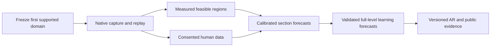

# Requirements for the final AXIOM system

[Русская версия](end-goal-requirements.ru.md) · [Architecture](architecture.md) · [Methodology](methodology.md) · [Milestones](roadmap.md)

Assessment date: 2026-10-09. Baseline: v0.1.0, commit `67080d6`. This document defines a proposed final product, its prerequisites and evidence gates. It does not claim implementation or empirical validation of those gates.

## 1. Final product contract

For an exact level revision, verified execution environment, information/practice protocol and specified player or reference population, AXIOM should produce:

1. A physical-evidence status: verified full-run witness, no witness found within stated search coverage, unsupported configuration, or a formally proved result in an explicitly bounded model.
2. Measured route/section requirements and robustness: local and joint acceptable input regions, alternative known strategies, state sensitivity and measurement coverage.
3. A human execution forecast at a specified preparation state, based on measured abilities and player-accessible observations.
4. A forecast `F(h)` of first completion by `h` active practice hours, with exposure, learning, full-attempt costs and unresolved dropout assumptions attached.
5. Supported T50 and AR with reference identity, uncertainty and scope; otherwise an explicit unrated result.
6. An explanation of measured requirements and fitted contributions, distinguishing predictive attribution from experimentally established causal effects.
7. A reproducible evidence card containing input hashes, native runs, dataset/model/reference versions, evaluation results, support limits and exclusion reasons.

Predicting previously unseen challenges is part of the goal. Summarizing campaigns that already happened is a useful baseline, but does not meet that requirement. An arbitrary new level may still be unsupported or unrated; universal immediate coverage is not an evidence gate.

Two supported reporting modes should be kept distinct: population AR for a frozen reference package, and personalized forecasts for measured player profiles. Frontier-player comparisons require a separate measured population; abilities from different people's best performances cannot be combined into one fictitious player.

## 2. Current implementation and missing chain

| Area | Available in v0.1 | Required for the end state |
|---|---|---|
| Level/replay acquisition | Supplied raw level string and GDR 1 JSON inspection | Convenient native export, original payload identity, declared clocks and audited format adapters |
| Environment | Declared challenge fields | Verified binary/SDK/adapter/mod/configuration manifest; supported capability matrix |
| Physical execution | No native execution | Real engine adapter, input acceptance trace, collision/death/finish observation and full-run witnesses |
| Repeatability | Consistency checks on supplied ledgers | Independent repeated native runs from the true beginning, trajectory/event comparisons and divergence diagnostics |
| Feasible regions | Supplied interval unions and linear constraints | Native perturbation measurements, disconnected regions, joint dependencies, alternative routes and tested continuation |
| Section composition | Not implemented | Reachable entry states, validated restoration where used, persistent physical and human state |
| Human execution | Assumed Gaussian jitter/common shift/AR(1) drift | Calibrated error distributions, omissions/holds, ability interactions, practice/context effects and correction policies |
| Perception and strategy | Not implemented | Observation-constrained visual/audio/memory model or explicitly narrower supported tasks |
| Learning | Descriptive Kaplan–Meier of supplied campaigns | Learned mapping from challenge demands, initial skill and practice to changing execution/strategy and completion hazard |
| Full-level forecast | Not implemented | Validated first-completion curve for unseen player/challenge combinations and variable attempt/death/restart costs |
| AR | Provisional transform of observed cohort T50 | Frozen reference package, supported target/reference medians and joint uncertainty propagation |
| Validation | Software and synthetic examples | Preregistered independent human prediction benchmarks, calibration, coverage, subgroup and dropout checks |
| Publication | GitHub, CLI and offline HTML | Versioned evidence/model/data cards, correction process and usable supported capture/analyze workflow |

The critical missing chain is **native challenge evidence → measured demands → calibrated human execution/learning → independent forecasts → eligible public AR**. A website, more factors or more Monte Carlo draws cannot complete this chain by themselves.

## 3. Proposed first supported domain

Start with classic levels on Windows x64, one actually inspected/tested game binary and one explicitly measured input policy. Begin native controls with short single-input fixtures; expand modes, gravity/size changes, portals/orbs, slopes, moving objects, triggers, camera effects, dual and further mechanics only when their capability tests pass. A fixture matrix is necessary before claiming coverage of general classic levels.

Treat CBF and other input policies as separately identified environments. Treat platformer as a later extension with distinct movement, checkpoint, restart and learning semantics. Freeze access to route information: learning an available route and independently discovering/verifying one are different protocols. These are proposed scope choices, not settled universal exclusions.

Pin the game binary and Geode SDK/bindings commits. Bindings provide version-specific addresses, signatures and fields; their presence is not verification of replay correctness or state completeness. [Official Geode bindings](https://github.com/geode-sdk/bindings)

## 4. Native measurement laboratory

Required deliverables:

- Reproducible compiler/SDK/CLI setup and a build tied to an explicitly supported game binary.
- Game-scoped opt-in capture of presses/releases, player/button, nominal/capture/accepted engine times, focus/pause/reset, both player states, outcomes and immutable manifests.
- Accurate separation of render cadence, physics updates, wall time, input acceptance and hardware/display latency. Unobserved latency remains unknown; a callback is not a direct measurement of physical device arrival.
- Replay from the actual beginning and an engine finish oracle. Noclip, corrected trajectories, arbitrary progress labels and short-horizon survival cannot satisfy normal-play witnesses.
- Local and multi-action perturbation maps, including multiple accepted bands, actual scheduling quantization, negative controls and delayed deaths.
- State-continuation comparisons if checkpoints/snapshots are used. Position/velocity alone are insufficient; world, trigger, buffered input, clocks, effects and unknown future-relevant state matter.
- A capability/unsupported-mechanics matrix, recording-overhead measurements and measured native experiment throughput.

Start with full restarts if restoration completeness is unresolved. A run with the same start must agree under predefined recorded comparisons before measuring fine windows. Publish repeat counts and observed divergence; finite agreement does not establish universal determinism.

Route search and optimality are separate deliverables. A seed successful replay can bootstrap measurements, but its route may be unnecessarily fragile. Label coverage as best known checked strategies unless broader optimization is justified. Failed bounded search never becomes proof of impossibility. Native checkpoint field definitions motivate completeness tests; they do not prove them. [Version-specific state/binding definitions](https://github.com/geode-sdk/bindings/blob/main/bindings/2.2081/GeometryDash.bro)

## 5. Human data and study design

Human data are an indispensable input. A successful macro, video or total attempt counter does not identify a player's typical errors, learning rate, prior practice, population first-completion distribution or effect of an unmeasured feature.

Create short controlled tasks measuring timing, interval/rhythm stability, burst speed, holds/releases, trajectory control and correction, mode transitions, coordination, perceptual cues and memory. Add prior-familiarity and preparation conditions, repeated sessions and retention/transfer checks. Initial tasks should vary a small number of mechanisms and produce both successes and failures; all 64 proposed factors need not enter the first fitted model.

Use a crossed player–challenge design: multiple players share anchor challenges and each player sees multiple demands. Record initial skills, available route information, prior practice, attempt mode/start, reached sections, accepted inputs, failure/completion, active exposure, breaks, strategy changes, missing recordings and quit/censor reasons. Thousands of correlated attempts from one person do not replace independent participants or new challenges.

A skill–difficulty–learning decomposition needs anchors and overlap. Isolated player groups on unrelated challenges cannot automatically produce one identifiable scale. Repeated-trial performance alone can confound acquired learning, prior familiarity, fatigue and strategy selection; the study needs controlled comparisons and explicit remaining assumptions.

Run an instrument-quality pilot, fit simple baseline models and measure variance, correlations, effect sizes, outcome frequency and dropout. Then determine confirmatory sample size by simulation-based precision/power analysis for the actual model and clustered design. Freeze the useful improvement, tolerable calibration error, interval coverage and evaluation horizon before testing. No arbitrary participant count is a universal sufficiency rule. [Lakens: sample size justification](https://doi.org/10.1525/collabra.33267)

As an illustration, an interval half-width of 25 AR corresponds to a multiplicative factor `2^(25/100) ≈ 1.189` in the median-time ratio. This is a meaningful precision target to discuss, not a preselected acceptance threshold. Inference implementation checks such as simulation-based calibration are a separate procedure from simulating study power/precision; they do not prove the fitted model describes real players. [Stan simulation-based calibration](https://mc-stan.org/docs/stan-users-guide/simulation-based-calibration.html)

Keep incomplete campaigns: their observation is that no completion occurred before follow-up ended. Address informative quitting separately. Fit and assess first-completion predictions with a stated censoring treatment; ordinary binary scoring at a horizon cannot silently label early-censored players as failures. [Stan survival models](https://mc-stan.org/docs/stan-users-guide/survival.html)

Choose the estimand explicitly: completion under a specified continued-practice protocol, or completion under natural behavior including quitting. The former can be counterfactual after a player quits and is not identified without additional assumptions; the latter may have a lifetime completion probability below 50%, so T50 need not exist at all. For the latter, permanent quitting is a separate competing outcome; temporary stops followed by return require additional states. Automatically censoring every quitter in Kaplan–Meier does not estimate this natural-behavior result. A quit-reason label does not resolve the distinction. Unknown prior practice, recording gaps and late entry also require explicit handling rather than a fresh-start campaign assumption.

## 6. Prediction model and research acceptance

Candidate initial models may be hierarchical statistical execution/learning/survival models; a large neural network is not a prerequisite. The architecture must learn a mapping from measured demands and initial player state to outcomes. Correlated error, human correction, memory and fatigue are mechanisms to test, not coefficients to invent.

Human-model policies may use only available image/audio/cues, memory and permitted feedback. Privileged engine state can verify physics and derive measurement features, but must not leak exact unseen coordinates or future outcomes into the modeled human controller.

First demonstrate prediction of short-section success on unseen players better than the preregistered independent-window baseline. Then test new challenges and full levels, carrying reachable physical state and human memory/fatigue/error state across section boundaries. Late-section exposure uses actual entrants; deaths and restarts consume active practice time. Preserve uncertainty through the whole pipeline.

Freeze player, challenge/revision/family and future-time holdouts; keep near-copies and shared section templates in the same split, and include a joint unseen-player/unseen-challenge test. Use probability calibration and proper scores, censoring-aware completion-curve assessment, interval coverage, subgroup checks, ablations and dropout sensitivity. Score improvements and acceptable deviations must be specified before the confirmatory test. Software correctness, posterior predictive checks and empirical held-out prediction are distinct evidence layers. [Predictive checks](https://mc-stan.org/docs/stan-users-guide/posterior-predictive-checks.html), [held-out evaluation](https://mc-stan.org/docs/stan-users-guide/cross-validation.html)

Top extremes require evidence covering their relevant timing, coordination, duration and preparation regime. Validation on easier tasks is not sufficient for narrow-window or exceptionally long-practice extrapolation. If enough reference-population completions do not occur to support T50, report budget-specific probabilities/limits or unrated status. A dedicated elite dataset is needed for elite forecasts; it cannot create a universal human impossibility boundary.

## 7. AR and publication requirements

Keep the proposed scale `AR = 1000 + 100 log2(T50 / reference_T50)`. Its interpretation requires a frozen population, joint skill distribution, initial familiarity, preparation/information protocol, technical environment and reference challenge/version.

Support both numerator and denominator; propagate their uncertainty jointly, including dependence. Publish model/reference versions and distinguish fixed-population from changing frontier results. No AR difference across incompatible packages should be interpreted as a time ratio without an explicit linking study. The reference must be established from evidence, not merely named as a popular level.

The public evidence card must identify origin/permissions, exact artifacts, full native runs, perturbation resolution/coverage, route/state assumptions, human cohorts/exclusions, model/reference/evaluation versions, confidence/uncertainty scope and support limitations. Allow independent reproduction and corrections. A public leaderboard becomes appropriate only for eligible calibrated results.

Begin with local capture, file-based evidence bundles, CLI and static evidence pages. Accounts, paid cloud GPUs, a distributed backend and a large website are optional delivery choices after correctness and demand are established. Storage can start with local files; database/upload operations require their own reproducibility, privacy and recovery design when introduced.

## 8. Resources, critical path and first checkpoint

Required capabilities are native C++/Geode engineering, Python/statistical modeling, experiment design, player/domain knowledge and participant coordination. One maintainer with Codex can combine software roles; consenting real players and independent human observations still take real time. A statistician/methods reviewer and external replication improve the eventual evidence.

The local audit confirms an installed game/Geode and part of a native build toolchain. A matching SDK/CLI setup and runtime compatibility remain untested. This is a starting resource, not native AXIOM support. Personal filesystem paths and user identifiers stay in ignored local reports; non-identifying game, adapter, mod and challenge hashes remain in reproducible public evidence where permitted.

Benchmark native throughput before choosing hardware or cloud budget. Illustrative computation only: one million independent one-second runs at real-time speed require approximately 11.6 continuous days on one worker before overhead. The current mathematical Monte Carlo loop is not a benchmark of native replay throughput. Accelerated runs, parallel instances or surrogate simulators require their own semantic/differential validation.

For a toy independent Bernoulli probability `p = 10^-8`, roughly 300 million draws are needed for a 95% chance of observing at least one success (`1-(1-p)^n`). This is not a measured GD probability. Rare-event methods are future candidates requiring validated weights and state continuity, not an automatic cure for model misspecification.

The next concrete checkpoint is a real short challenge with an immutable environment manifest, a full successful native replay repeated under declared comparisons, measured press/release perturbations followed through terminal outcomes, and an exported evidence report. It must measure recording overhead and throughput and state all unsupported mechanics. This closes the first engineering uncertainty before a human confirmatory study or timetable for a full public rating system.

Estimate the larger schedule and compute cost after this checkpoint and the instrument-quality pilot. They depend on native scheduling/restoration feasibility, recruitment, event frequency and model generalization; repository size or completed software tests do not determine them.

## 9. Meaning of completeness

The goal is an extensible system with demonstrated predictive adequacy inside a declared domain. No finite factor registry guarantees that every physical, perceptual, cognitive and technical influence is known. Admit factors by reliable measurement, residual-error investigation and out-of-sample improvement; avoid counting one mechanism twice.

Physical witnesses, bounded search, calibrated human probability and universal impossibility are different claims. AXIOM must retain that distinction even if a single AR number is convenient for the interface.
